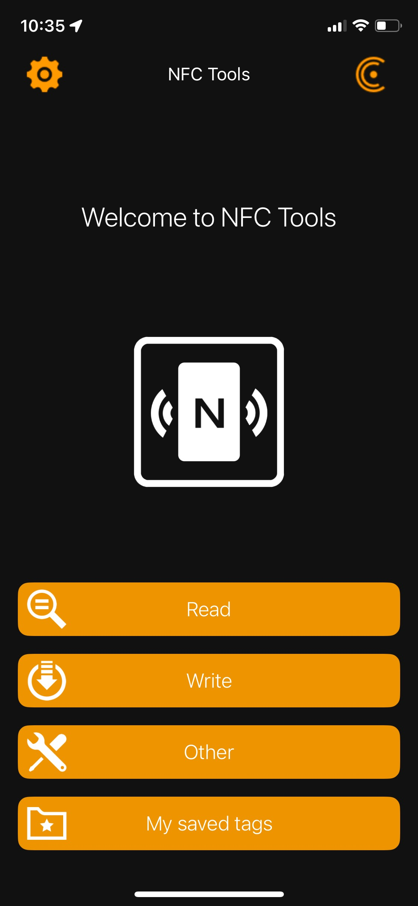
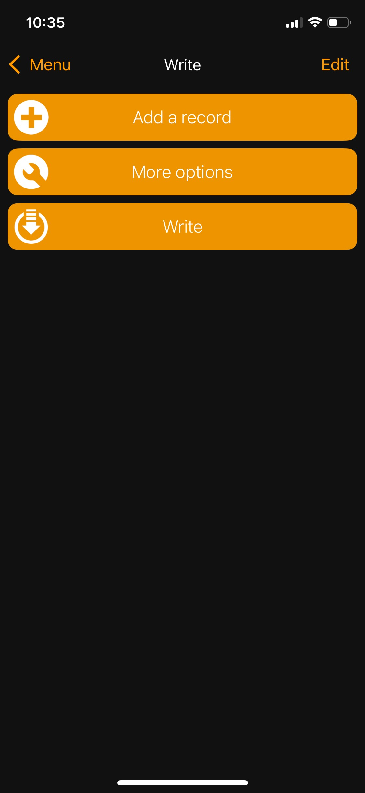
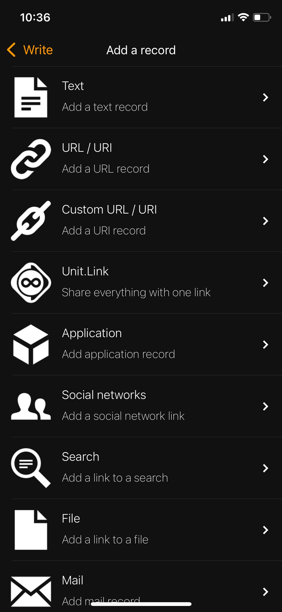
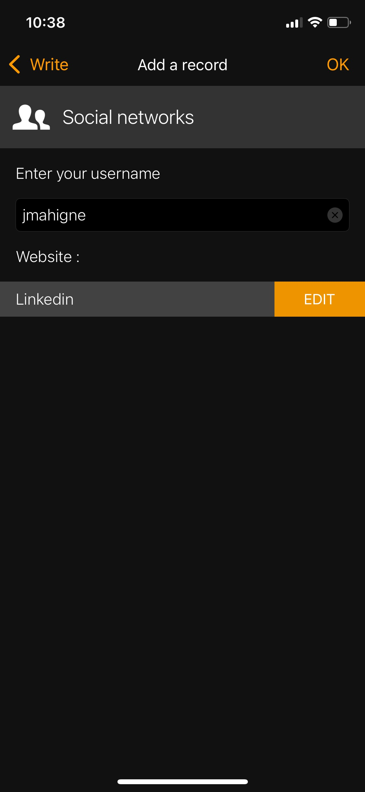
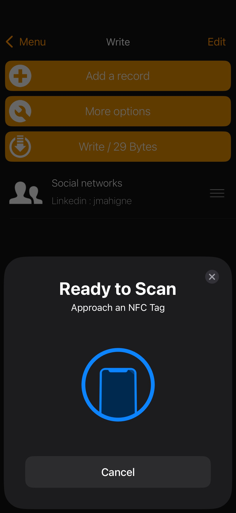
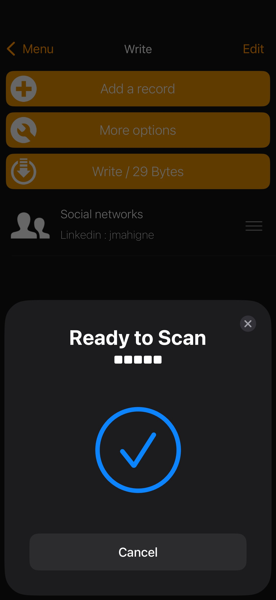

# Welcome!

Nice! It seems you recieved a custom nfc card made by Judrianne "Jude" Mahigne. This tutorial will show you the basic configuration of your new card and features and recommendations on how to use it. 

## Introduction
NFC (Near Field Communication) tags are small, programmable chips that can store data and trigger actions when scanned by an NFC-enabled smartphone. The **NFC Tools** app, available on both **iOS** and **Android**, allows users to easily write, read, and manage NFC tags. This tutorial will guide you through the process of setting up and writing data to an NFC tag step by step.

---

## Prerequisites
Before you start, ensure you have the following:
- A smartphone with NFC capability (most modern Android and iOS devices support NFC).
- An NFC enabled card that you recieved.
- The **NFC Tools** app installed from the **App Store** (iOS) or the **Google Play Store** (Android).

---

## Step 1: Open the NFC Tools App
1. Ensure NFC is enabled on your device:
   - **Android:** Go to **Settings** → **Connected devices** → **NFC** and toggle it **on**.
   - **iPhone:** NFC is automatically enabled on supported devices (iPhone 7 and newer).
2. Launch the **NFC Tools** app on your smartphone.

---

## Step 2: Select "Write" Option
1. In the NFC Tools app, tap on the **Write** tab.
2. Select **Add a record** to begin adding data to the NFC tag.

---

## Step 3: Choose a Record Type
The **NFC Tools** app has many ways to link not only your social media accounts but to other apps or websites as well.
- **Text** (e.g., a message or note)
- **URL** (e.g., a website link)
- **Phone number** (e.g., a contact or emergency number)
- **Email** (e.g., a pre-filled email template)
- **WiFi** (to share WiFi credentials)

For now, let's choose **Social networks** to link your LinkedIn account since it does have a cool LinkedIn logo afterall. Don't worry, you can always go back and change it to something else afterwards.

### Linking your LinkedIn Account
1. Select **Edit** from the website below. The default is usually Facebook so let's change that.
2. Select **LinkedIn** from one of the choices.
3. Don't forget to fill in the **Enter your username** field to your LinkedIn account. Your username is located here: https://linkedin.com/in/{Username}
4. Select **OK**

---

## Step 4: Write Data to the NFC Tag
1. Tap **Write / XX Bytes** (the size will vary based on your data).
2. Place your NFC tag on the **top edge of your iPhone** or near the **back of your phone** (for Android).
3. Hold it steady until you see a confirmation message stating **Write complete**.

---

## Step 5: Test the NFC Tag
1. Remove and re-tap your phone against the NFC tag. Just like before, **top edge of your iPhone** or near the **back of your phone** (for Android).
2. If the write operation was successful, your phone will read the tag and open the stored URL (or perform the stored action).

---

## Congratulations!
You just completed your custom nfc card setup! If you want to change the social media account or use a custom URL you can just follow **Step 3** through **Step 5** again to change it.

## Additional Features
- **Erase a Tag:** Go to the **Other** tab and select **Erase tag** to remove previously written data.
- **Lock a Tag:**: (WARNING! This action is irreversable and cannot be rewritten after locking!) This write action serves as a security measure so that no one can manipulate your card without knowing.
- **Set password**: Setting a password is less permanent than locking your tag but once it is set you are unable to change the tag without the password. This is also irreversable.

---

## Troubleshooting
- **Tag Not Detected?** Ensure your phone’s NFC feature is enabled and hold the tag closer for a few seconds to the NFC scanning area.
- **Write Error?** Some tags may be read-only or locked. Let me know if this error happens as all cards are made without passwords.
- **Tag Doesn’t Trigger?** Check if your phone’s NFC reader is working by testing a different tag.

---

Happy tagging! 🎉

LinkedIn: https://www.linkedin.com/in/jmahigne/